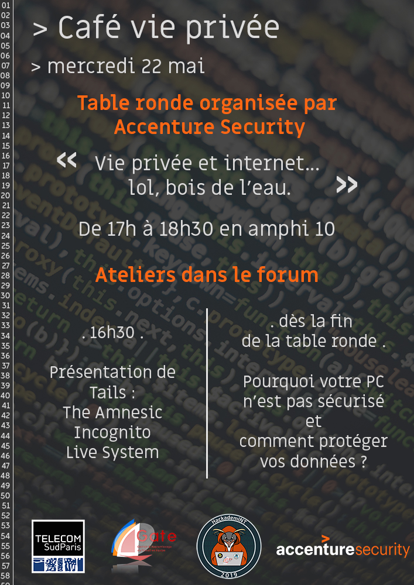

# Introduction

Le projet GATE HackademINT 2019 est né de la passion d'une équipe pour la
cybersécurité. A travers une formation continue et des challenges réguliers,
nous avons pu remplir nos objectifs de développer nos connaissances mais aussi
et surtout de développer le club HackademINT. Cette progression a abouti le 22
mai à l'organisation du Café Vie Privée avec le désormais partenaire du club
HackademINT Accenture Security.

# Équipe et organisation

L'équipe a été selectionnée par le client en début d'année, grâce à une plateforme de recrutement (https://star2018.hackademint.org/) suivi d'un entretien. Voici les postes : 

#### Chef de Projet :
{height=20%}

#### Pôle Formation :
{height=50%} {height=50%}

#### Trésorerie :
{height=50%}

#### Communication :
{height=50%} {height=50%}

#### Logistique :
{height=50%}

#### Secrétariat :
{height=50%}

Des "Write-ups" ou comptes rendus des challenges auxquels l'équipe du GATE a participé était le livrable principalement attendu par le client. Bien que chaque membre du projet occupe une place différente au sein de l'équipe, nous participions tous, sans distinction de poste, aux épreuves auxquelles l'équipe était inscrite. Ainsi, la rédaction des comptes rendus était distribuée entre tous les membres, selon les challenges résolus par chacun.

# Déroulement général

@Headorteil

## Réalisations et livrables

Les objectifs que nous avions étaient assez vaste. Nous nous sommes tout d'abord penché sur former le club pour qu'il puisse rapidement se développer. Le but était de très rapidement participer à des compétitions pour promouvoir le club et Télécom SudParis. 

A force de faire des compétitions, nous avons commencé à obtenir des scores honorables pour des étudiants de première année, et assez régulier pour que nous soyions reconnu par les autres compétiteurs.

Pour donner de la visibilité au club, nous avons modifié le site et y avons proposé régulièrement des Writes Ups (Correction personnelle de Challenge de CTFs qu'ils soient en ligne ou physique) et communiqué nos déplacements aux divers événements sur twitter.

Pour le campus, nous avons choisi de proposer un *café vie privé*. L'idée était d'apprendre des moyens de se protéger (Comment chiffrer leur données, protéger leur vie privée). Nous avons proposé des ateliers tels que la création de clés USB tails en partenariat avec Accenture Security qui a proposé une table ronde sur la vie privée et de sponsoriser le club.

## Attentes vs Réalité

Au vu des livrables attendus, les délais ont été respectés. Ils concernaient notamment le café vie privée, les compétitions auxquelles nous avons participé, leurs résultats et les *writeups*,  

Afin de nous entraîner, nous avons, dès le début du projet, participé à des CTFs en ligne. Cela a été l'occasion d'avoir un premier aperçu des différents domaines à découvrir. Même si cela a été quelque peu laborieux, nous avons alors commencé a rédiger nos premiers *writeups* et à les mettre en ligne sur notre site <https://www.hackademint.org>. Ainsi, une première période de formation a été nécessaire. Elle était attendue de nous tous et a été globalement appréciée. 

Notre objectif principal, au niveau des participations à des CTFs, était le BreizhCTF, pour évaluer les progrès par rapport à l'année dernière. Il s'est révélé que nous avons participé à bien plus de compétitions, dont :

* Cybersecurity Night Out (Wavestone - 28/11) : **1ère** place sur 9
* TRACS (Viarezo & DGSE - 08/12) : 17ème sur 53
* NorzhCTF (22/01) : 13ème sur 14
* HackSecuReims (01/02) : **4ème** place sur 32
* Mars@Hack (06/03) : **1ère** place sur 15
* CTF ESAIP HACK CHALLENGE 2019 (16/03) : 13ème sur une trentaine d'équipes
* BreizhCTF (16/04): **11ème** sur une soixantaine d'équipe, l'année dernière, l'équipe GATE était arrivée à la 32ème place
* INS'hAck 2019 (02/05) : **2ème** place sur 22

Même si des membres du club, ne faisant pas partie du projet GATE étaient parfois présents, plusieurs membres du GATE étaient à chaque fois présents pour constituer un équipe.

Nous avions également initialement prévu d'organiser des rencontres autour du thème de l'hygiène numérique. Aucune date n'avait été prévue au début du projet.  Ce livrable a pris la forme d'un *café vie privée*. Nous avons ainsi pu organiser, le mercredi 22 mai, une table ronde avec notre partenaire Accenture Security. Cette table ronde a été accompagnée d'ateliers que nous avons choisis et animés.  
Il s'est avéré que l'événement a été réussi, une trentaine de personnes était présente, et la table ronde a globalement plu, de même pour les ateliers.  
Nous voulions ouvrir cet événement au plus grand nombre, aux élèves mais aussi au personnel et professeurs des deux écoles. Nous avons contacté les services de communication de l'école afin de transmettre le message, mais notre demande est malheureusement restée sans réponse...

Concernant le budget, nous avions estimé que notre seule dépense allait concerner le déplacement au BreizhCTF en train, ç'a été le cas. Pour cela nous avons financé une partie des billets grâce à une vente de samoussas lors d'une scène ouverte organisée par le Bureau des Arts des écoles au foyer associatif.

Nous comptions également avoir nos potentiels sponsors aux alentours de février, si nous devions en avoir. Il s'est avéré que Xavier-Henri, trésorier et responsable relations entreprises du projet, a commencé à négocier avec Accenture Security à cette période, le partenariat a été confirmé en mars / avril. Cela nous a également permis de planifier le café vie privée avec l'intervention d'Accenture Security, faisant partie du partenariat. Ce dernier permet aussi de remplir l'un de nos autres objectifs : aider le club HackademINT à se développer.  

La comparaison entre ce que nous attendions et ce qui a été réalisé est donc plutôt bonne. Nous avions peut-être été trop ambitieux sur le café vie privée lors de certaines réunions où beaucoup d'idées avaient été proposées, mais l'événement a été, de notre point de vue et des retours que nous avons eu, réussi.  
Les formations que nous avons suivies ont été utiles et ont très certainement participé aux bons résultats de l'équipe de cette année. 

## Relations humaines et management

@Boisdal

## Gestion des risques

@patate

## Gestion de projet et suivi

@Frazew

# Dossier Bilan

## Bilan collectif

@Archonte

## Vincent BOISDON

Ce GATE® m'aura permis de m'initier à la cybersécurité sans avoir à attendre les vap, et m'aura ainsi confirmé que la vap SSR est celle qui me plairait le plus. Par ailleurs j'y ai aussi découvert la gestion de projet en grosse équipe et toutes les difficultés inhérentes à celà.

HackademINT m'aura apporté une formation fort utile dans les domaines utiles en CTF tout en me permettant de me forger un réseau de contacts de qualité et très appréciable dans le milieu

Tout les efforts fournis donnent de plaisants résultats et cela me satisfait beaucoup de penser que nous avons grandement amélioré le classement de l'équipe hackadem'INT par rapport aux autres années. Nous sommes désormais reconnus quand nous arrivons sur un CTF et sommes considérés comme des candidats sérieux et comme des adversaires à surveiller. Et cela est d'après moi la meilleure des récompenses pour tout le temps consacré à s'entrainer.

L'autre moment fort enrichissant fût le café vie privée qui nous a permis d'apprendre à de nombreux élèves à se servir d'environnement sécurisés et de les sensibiliser grâce à la conférence de notre partenaire Accenture Security. J'ai pu à ce moment sentir à notre projet une utilité plus vaste que simplement personnelle ou pour la gloire du club et de l'école. Nous avons à ce moment été utiles à tous les gens du campus qui le souhaitaient. 

Je sors donc de ce projet GATE® avec beaucoup d'expérience en cybersécurité mais aussi en gestion de projet, fin prêt à former les 1As de l'an prochain pour qu'à leur tour ils puissent mener un projet semblable.

## Arthur BOYER

## Bruno DENNEMONT

Le projet GATE® a été très épanouissant. Cela a en effet été la première fois où je m'impliquais dans un projet sur une si longue durée. J'avais beaucoup d'attente dans ce projet, c'était le moment pour moi de me mettre à la cybersécurité.

J'ai très vité réalisé qu'il allait falloir que je m'investisse au maximum pour progresser. Nous nous sommes formés en lisant beaucoup de documentation et grâce à des sites tels que [Root-Me](https://www.root-me.org), [NewbieContest](https://www.newbiecontest.org) et [OverTheWire](http://overthewire.org/wargames/). Ce que j'ai le plus apprécié, ce sont les **Capture The Flag**s (CTFs). Ils consistent en des "enigmes" de cybersécurité et ont l'avantage de beaucoup faire réflechir (comme des énigmes). Ces jeux nous ont formés à pouvoir réfléchir en toutes circonstances, à être actif la nuit mais aussi de nombreuse compétence. Pour être au niveau, il faut avoir des connaissances dans un maximum de language (PHP, python, javascript ...), en réseau sur les trames et les faiblesses, en mathématiques pour la cryptographique ... . De plus, ils permettent de découvrir de nombreuses entreprises partout en France car les compétitions ont lieu partout et sont souvent précédées de forums et de conférence.

J'ai très rapidement progressé et pu proposer des formations aux autres membres du club ce qui est encore plus formateur. Au final, il y a une grande différence entre effectuer un challenge et en proposer. Il faut se projeter et faire un très grand effort sur soi-même pour expliquer. 

Mon bilan sur ce projet est plus que positif car il m'a permis d'acquérir des compétences et connaissances non négligeables que je n'aurai pas pu apprendre ailleurs. 

## Thomas DOUDAT

Le GATE® HackademINT à été très enrichissant pour moi, sur de nombreux aspects. J'ai pu m'épanouir dans ce projet qui a su m'apporter tout ce que j'attendais de ce dernier.
En effet en choisissant HackademINT qui m'a été présenté comme un projet technique, je m'attendais à développer des compétences dans ce domaine qui me passionne : la cybersécurité; je n'ai pas été déçu, bien au contraire.

HackademINT m'a apporté une formation technique et culturelle sur le milieu du hacking et de la cybersécurité qui sont des milieux très mystérieux sur lesquels beaucoup de monde a une vision biaisée.
J'ai, grâce à HackademINT, au travers des nombreux CTF, forums de cybersécurité et divers autres événements auxquels nous avons participé, pu me forger mon propre avis sur la chose et ainsi découvrir un univers passionant qui m'a conforté dans mon projet professionel.

Au dela des compétences techniques que j'ai acquises, j'ai également, grâce à ce GATE®, rencontré des grands noms de la cybersécurité et ainsi commencé à développer mon réseau afin d'être au mieux préparé pour mon entrée dans le monde du travail.

Mon implication m'a valu d'être élu président de HackademINT, ce qui m'a permis de développer encore plus mes compétence en communication, en leadership ainsi qu'en travail et gestion d'équipe.
Cette promotion m'a également apprise à me familiariser avec l'administratif et le fait d'avoir des responsabilités.
Elle m'a d'autant plus motivé à faire grandir ce club qui a subi une explosion cette année que ce soit en terme de nombre de membres actifs, de visibilité (HackademINT est désormais reconnu par de nombreuses équipes de CTF en france), de budget ou d'infrastructure réseau. Nous avons même désormais un local dans le foyer étudiant.

Au final, je ne tire que du bien de cette expérience qui en plus d'avoir été professionalisante et riche en émotions m'a également permise de développer de nombreuses compétences aussi bien non techniques que techniques.

## François HORTA

En raison de ma passion pour l'informatique et la cybersécurité, le projet GATE
HackademINT 2019 m'était apparu comme une évidence en début
d'année. C'est donc assez naturellement que j'ai pris beaucoup de plaisir à
développer mes compétences et celles de toute l'équipe à travers les formations
du club HackademINT et les participations aux CTFs. 

J'ai eu le rôle de chef de projet, et j'ai essayé de m'y tenir en dépit de mes
autres responsabilités ailleurs. J'avais déjà eu l'occasion auparavant de gérer
des équipes sur des projets concrets, mais l'utilisation de méthodes agiles
comme nous l'avons fait était nouvelle et s'est avérée être une découverte intéressante.

Au delà de la progression personnelle en matière de cybersécurité et de gestion
projet, je tire surtout de ce GATE la satisfaction d'avoir aidé le club
HackademINT à se développer et à obtenir une visibilité et une renommée indéniables
sur la scène française des CTF. 

## Xavier-Henri MONIER
Cela a été un plaisir de travailler sur ce projet technique, au sein d’un GATE® travaillant autour d’une thématique extrêmement intéressante et absente de l’enseignement de première année.
Mon année au sein de ce projet s’est scindée en deux parties distinctes et complémentaires, représentant bien les différents aspects nécéssaires au développement du club.

J’ai tout d’abord été très actif au sein de la partie technique du GATE®, participant à de nombreuses compétions physiques (CyberNightOut n°5, Mars@Hack où nous sommes arrivés premiers ou encore BreizhCTF où malgré le niveau très relevé, nous avons obtenu la 11ème place). Je me suis ainsi spécialisé dès le début d’année dans la Stéganographie et, plus tard dans l’année, je me suis formé afin de pouvoir également traiter les problématiques de programmation posées en CTF.

En parallèle de ce travail technique, j’ai effectué une grande quantité de travail non technique au sein du GATE®. Ce travail, qui m’a valu le poste de vice-président en charge des relations extérieures au sein du club, a culminé le 22 mai lors de la table ronde de notre partenaire Accenture Security, qui a attiré des élèves, des enseignants mais également du personnel de la DISI. Cette table ronde représente la conclusion de mois de négociations avec mes contacts chez Accenture Security afin d’aboutir à un sponsoring qui permette de donner à un club naissant (qui comptait deux membres vraiment actifs en août dernier) une vraie dynamique de progression en termes d’effectifs (une quinzaine aujourd’hui). Mais aussi en termes de résultat dans de nombreux CTF en ligne comme physique avec l’entrée de l'équipe dans le top 20 français des équipes de CTF (devant les équipes de nombreuses entreprises !).

En résumé, ce projet m’a permis de développer trois skill sets en parallèle, tout d’abord, via les compétitions, mes compétences techniques. Ensuite, durant les compétions physiques mais aussi pendant les formations, mes compétences de travail d’équipe. Enfin, via les négociations avec de nombreuses entreprises (qui ont abouti sur un sponsoring de 1850€ par Accenture Security), mes soft skills !

## Gabriel PRÉVAULT

Le projet GATE a été pour moi la première fois que je me suis investi dans un projet sur une si longue période. L'idée initiale d'HackademINT 2019 m'avait assez intéressé et j'ai pris beaucoup de plaisir à acquérir de nouvelles connaissances grâce aux formations que nous avons effectuées au début du projet et aux compétitions en ligne auxquelles nous avons participé. 

Cette expérience m'a également permis de me rendre vraiment compte des difficultés que l'on peut rencontrer lorsque l'on doit mener à bien un projet de groupe. Pour ma part, cela s'est notamment ressenti lors de l'organisation du café vie privée. J'ai ressenti un manque de communication et d'organisation au sein de l'équipe, mais cela n'a pas empêché l'événement d'être un succès. J'ai, de plus, eu du mal à trouver ma place dans le groupe et au fur et à mesure de l'année, je me suis désintéressé du club HackademINT, qui reste fortement lié au projet GATE.

En tant que responsable communication, j'ai apprécié pouvoir réaliser différents types de visuels, d'une image pour une publication sur Facebook à différentes affiches pour la café vie privée ou celle pour la clôture de GATE, en passant par une nouvelle version du logo du projet. C'est la première fois que ce que je réalise sert effectivement à quelque chose, et le fait de travailler en groupe permet également d'avoir un retour sur son travail et donc d'améliorer des points que je n'aurais pas pu remarquer seul.

Ainsi, le projet HackademINT 2019 m'a permis, au départ, de mieux découvrir la cybersécurité, domaine sur lequel j'avais des fausses idées, puis je me suis en quelque sorte "détaché" du côté technique. J'ai continué d'assumer mon rôle en tant que responsable communication, et ne me suis que très peu investi dans le club HackademINT en lui-même. Je ne pense pas rester investi dans le club l'année prochaine, mais cela a été l'occasion d'acquérir quelques compétences techniques et de gestion de projet.

## Alice ZHEN

J'ai intégré le GATE HackademINT en début d'année avec comme motivation principale la possibilité de développer à travers ce projet des compétences techniques.

Si les premiers mois ont été difficiles dans la mesure où il a fallu développer des automatismes techniques et assimiler une importante variété de connaissances, j'ai pu atteindre au cours de l'année une zone de confort à partir de laquelle il m'était bien plus aisé de continuer à progresser. 

Les nombreuses compétitions auxquelles nous avons participé partout en France m'ont permis de découvrir et d'apprécier le vaste milieu de la cybersécurité.

Les expériences vécues tout au long de l'année ont été très enrichissantes autant d'un point de vue technique qu'humain. En effet la diversité des challenges rencontrés permet de toujours avoir un domaine à approfondir et pousse à s'améliorer sans se reposer sur ses acquis.

Au terme de cette année, je suis globalement satisfaite de ce que nous avons pu accomplir. Je suis reconnaissante de la chance que j'ai eu d'intégrer ce projet technique très formateur.

# Conclusion

\pagebreak

# Annexes

## CR réunion du 27/11/18

Présentation du powerpoint de validation

### Formation

Cours "RE for beginners" pour débuter le reverse suggéré par Gregory Blanc.
Evocation des formations et démos de sensibilisation pour le campus. Apprendre par exemple à chiffrer ses mails.

### CTFs
Point sur leCTF Wavestone du mercredi 28 et le Tracs qui sont les prochains CTF à arriver.

Est-ce qu'on fera les qualifications pour la Nuit du hack ? Bon pour l'image, mais en fin d'année...

Il faut produire des writeups de qualité et les rendre disponibles facilement.

### TODO

Pour la prochaine fois : il faut trouver une date de réunion, proposition : mercredi 12 decembre 17h.
Il faudra un ordre du jour, avec les compte rendus des 2 ctf

\pagebreak

## CR réunion du 12/12/18

### Actions faites
Point fait sur les deux derniers ctf : Wavestone et TRACS

### Suivi
Aucun problème si certains se spécialisent, l’important c’est de se former là où on est en manque en CTF au niveau de l'équipe.
Attention cependant à ne pas etre dépendant du club pour la formation.

Penser à faire le planning au fur et à mesure : remplir ce que l’on fait dans le planning quand on le fait.

\pagebreak

## CR réunion du 28/01/19

### NorzhCTF

Décevant, pas assez de compétences en réseau pour accéder à la plateforme CTFd, et donc pas assez de temps pour faire les challenges (ex : rooter une machine Windows, se connecter sur un Kali, volatility).

A quand même permis de découvrir des outils commme zmap, en situation réelle.

Active Directory

$\rightarrow$ cours de 3è année...

### AESCTF

Bruno a créé une plateforme en ligne de challenges de CTF concernant l'AES.
Quelques challenges de découverte, avec documentation.

Une dizaine de challenges en tout.

Projet de faire des challenges sur les anneaux modulaires, avec de la doc en plus, ce qui n'est pas le cas sur StarHackademINT.

### Formation pwn

Fonctionnement général des buffer overflow, pour les CTFs.

Première fois qu'on voit ça, points perdus sur d'autres CTFs.

Résolution par injection ou en comprenant son fonctionnement (qui peut permettre de trouver un point d'injection).

### Sponsors

* Réponse avant début février pour Accenture.
* Advance ?

Postes de dépenses ? Aucun $\rightarrow$ voitures de l'école.

Quand même vérifier si des voitures sont disponibles au moment du BreizhCTF.

### Café cybersécurité

Lockpicking à rajouter dans la liste des projets potentiels $\rightarrow$ pas forcément adapté en fait. Sinon, à présenter comme de la sensibilisation

Mettre en place ???nginx pour faire du man-in-the-middle facilement
Doivent accepter un certificat

Nicolas: obfuscateur vba ?

Présentation des idées :

* man-in-the-middle : autorisation DISI ? Ne pas casser les mots de passe des gens ! Montrer qu'à partir d'autres hash, on peut faire ça, mais pas le faire directement. Voir pour des comptes eduroam tests avec la DISI ? Faire signer les gens qui participent.
* vérification d'identité mails. Intérêt de PGP pour éviter l'usurpation d'identité
* Présentation de Keepass. Pourquoi c'est utile ?

Idées pas rajoutées...

* Lockpicking ? 
* RFID : Partenariat Intech ? 
* Rubber Ducky
* Malduino

Voir pour la date...

À bien contextualiser, rendre les gens concernés (sur eduroam, pas un autre réseau de test, mais avec **autorisation DISI**), présentation pas trop technique. 

### Bilan

Des progrès, mais se dépêcher sur le café vie privée, pour l'ADM = retour sur ce qui a été fait, justification de la participation aux CTF.

### Autres

Voir iCTF

CTF physique du type escape game ?

Lockpicking (épreuve BreizhCTF)

\pagebreak

## CR réunion du 26/02/19

### Retour HackSecuReims

Meilleur jusqu'ici, tout le monde a pu réussir à trouver quoi faire. 

Échelonnage des difficultés et bonne ambiance.

### Autres petits CTF

Permettent de contribuer à CTFtime : TamuCTF, Sogeti, ...

Sogeti : peu de challenges et assez compliqués

### AESCTF

Par Bruno. Modifications en fonction des retours.

Inspiré par Root-Me et d'autres CTFs.

Sur le github HackademINT

> Mettre les solutions en privé peut-être

### Partenariat Accenture Security

Partenariat à hauteur de 1000€. 1000€ en plus en l'échange de l'organisation de 2 événements sur le campus (tables rondes) sur la cybersécurité, un avant les grandes vacances et une à la rentrée 2019. Thèmes : cyberintelligence, futur de la cybersécurité

En discussion, pour 40 / 50 personnes pour que ce soit bon

Création d'un Hackaton cyber [événement physique] pour Accenture par la fondation Mines-Télécom, on nous a proposé de le faire. À faire en même temps que le CTF de recrutement. Bonne visibilité

Prix proposé pour le CTF : 3000 à 4000€

Voir pour IMT Atlantique, Nancy, St-Étienne, Lille Douai (Santhacklaus)

### Café vie privée

G. Blanc et O. Berger

> Date à fixer

Faire une réunion pour voir ce qu'on veut faire, sûrement pas avant mai

Et voir Mme. Nigaglioni

### Local ?

Pas de non définitif, voir avec les autres utilisateurs.

Salle de réunion U7 :

- Forum : pas de soucis
- Sprint : en même temps que les ouvertures de Nova...
- une liste ASINT l'utilise également

### Formations

- Reverse engineering à l'ENSIIE
- Formation Flask
- Formation RFID (matériel déjà là, à préparer d'abord)

### Communication

> Peut-être plus, sur les formations, montrer qu'on est actif

Sur le café vie privée

Projet d'une chaîne youtube HackademINT, stream des formations ?

### Nouveau site

Pour mieux indexer et présenter les writeups

> Mots-clés et moteur de recherche

### Prochaines actions

- café cybersécurité
- voir pour Sogeti en fonction du classement
- faire une base commune de scripts (à venir avec les writeups), tout n'a pas à être forcément public, à choisir
- prochain CTF physique : Mars@Hack

\pagebreak

## CR réunion du 26/03/19

### CTFs

**Mars@Hack :** 

**ESAIPHack :**

*À venir :*

- leHACK : pas possible
- Orange
- INS'hAck
- HACKLAB-ESGI CTF
- ESIEA SECURE EDITION

### Café vie privée

Il faut avancer

> Voir avec Mme. Nigaglioni pour la date rapidement

Table ronde Accenture

Démonstration d'interception de mdp WiFi : man in the middle  
Aspect légal  
Créer un portail sur lesquels les gens peuvent s'inscrire, mais faut prévenir d'abord pour éviter que les gens mettent les mot de passe qu'ils utilisent d'habitude  
Mot de passe généré automatiquement, mais pas modifiable  
Contexte du portail : questionnaire ? Redirige vers un gform ?  
Faire des quiz, ou un CTF. Peut-être un lot, clé USB  

> Ordinateur à l'accueil, ou DISI, ou MiNET    

Montrer qu'on peut en prendre le contrôle  
Mais aussi montrer qu'on peut sécuriser de manière simple  

Demander un compte test à la DISI

Masters spécialisés

Branding clés USB : Accenture, HackademINT, Gate ?  

Il faudra faire un retour dessus

### Gestion des finances

Réception des financements d'Accenture  
Par la fondation Mines-Télécom

Table ronde RGPD & données personnelles cette année au café vie privée : 1000€  
L'année prochaine en octobre : une autre plus complète pour le reste des fonds

Fondation MT intéressé par un Hackathon cyber : en discussion

### L'IP Paris

Projet de faire quelque chose en commun avec d'autres écoles  
ENSTA, ENSAE, TPT et Centrale peuvent rediriger vers nous

### BreizhCTF

Problèmes d'inscription, seulement s'il y a des désistements

### Niveau site

<https://ctf.hackademint.org> : fbCTF, recrutement de l'année prochaine

Site pour déposer les writeups prêt : reste à les faire

### Clip de présentation

Faire une vidéo peut-être moins humoristique, il n'y a aura peut-être pas le son (vu sur Facebook)  
Faire mieux passer le message de ce que fait le projet

## Affiches diverses

{height=30%}

{height=40%}
